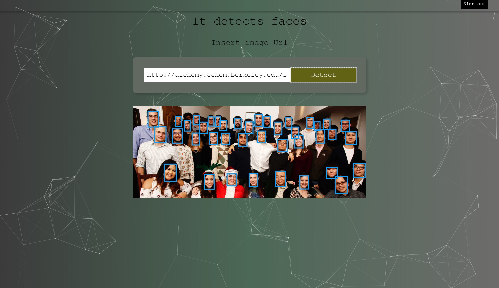

# Face recognition app using reactjs with multiple face detection

## Discription
#### The Frontend part of the project is implemented on  `reactjs`. 
In order to use app just paste any image URL from google in input then press Detect 
button it will detect all faces from given image. 

### Technologies 
* API used : Clarifai api
* Javascript
* CSS
* React
 
#### The project uses clarifai api for face detection

 
## See the demo [here](https://glacial-dusk-96205.herokuapp.com/)

## Installing

To run the application locally, you will need to clone the repository to your local machine.

HTTPS:
````
$ git clone  https://github.com/squarefozilov/faceRecognition.git
````
SSH:
````
$ git clone  git@github.com:squarefozilov/faceRecognition.git
````
Install NPM packages
```sh
npm install
```
## Product features ones the user puts URL of the image the app shows faces.

 
